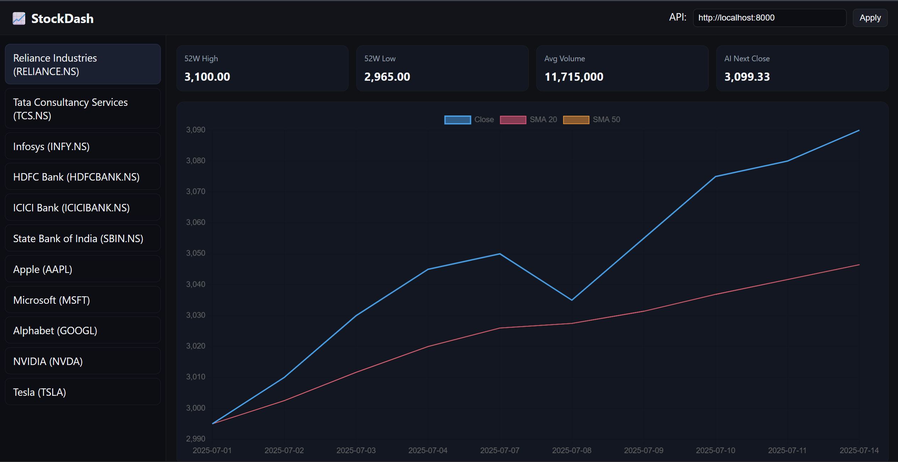

# 📈 StockDash — Full Stack Stock Market Dashboard

A complete **Stock Market Dashboard Web Application** built for the JarNox Internship Assignment — featuring **real-time (or offline) stock data**, technical indicators, AI prediction, and a clean, responsive UI.

---

## 🚀 Features

### 🎨 Frontend (HTML/CSS/JS)
- Clean, **dark-mode responsive** UI
- **Left panel**: scrollable list of 10+ companies
- **Main panel**:
  - Price chart (Close, SMA20, SMA50)
  - RSI(14) chart
  - **Stats cards**: 52-week High, 52-week Low, Average Volume
  - AI-predicted **next-day close price**

### 🖥 Backend (FastAPI)
- REST API endpoints:
  - `/api/companies` — Company list
  - `/api/history` — Historical stock data
  - `/api/predict/next` — AI prediction
- **Data sources**:
  - Live via `yfinance`
  - Offline fallback to **mock CSV dataset**
- Technical indicators: SMA20, SMA50, RSI14
- CORS enabled for easy frontend integration

### 🌟 Bonus
- Fully functional offline
- **Dockerfile** for easy deployment
- Easily extendable to SQLite/PostgreSQL storage

---

## 🛠 Tech Stack

**Frontend**:
- HTML5, CSS3, Vanilla JavaScript
- Chart.js for charts

**Backend**:
- Python, FastAPI
- Pandas, NumPy, yfinance
- scikit-learn (Linear Regression prediction)

---

## 📂 Project Structure
```plaintext
stockdash/
├── backend/
│   ├── app.py
│   ├── datasource.py
│   ├── indicators.py
│   ├── schemas.py
│   ├── companies.json
│   ├── requirements.txt
│   ├── Dockerfile
├── frontend/
│   ├── index.html
│   ├── styles.css
│   ├── app.js
├── data/
│   ├── AAPL.csv
│   ├── RELIANCE.NS.csv
│   ├── TCS.NS.csv
│   ├── INFY.NS.csv
│   ├── HDFCBANK.NS.csv
│   ├── ICICIBANK.NS.csv
│   ├── SBIN.NS.csv
│   ├── MSFT.csv
│   ├── GOOGL.csv
│   ├── NVDA.csv
│   ├── TSLA.csv

#⚡ Quick Start

## 1️⃣ Clone the repository
```bash
git clone https://github.com/YOUR_USERNAME/stockdash.git
cd stockdash
```

## 2️⃣ Backend setup
```bash
cd backend
python -m venv .venv
# Activate env
# Windows:
.venv\Scripts\activate
# macOS/Linux:
source .venv/bin/activate

pip install -r requirements.txt
uvicorn app:app --reload --port 8000
```

### Backend runs at: http://localhost:8000

---

## 3️⃣ Frontend setup

*Open frontend/index.html in your browser
*Or run with VS Code Live Server (recommended)
*In the top-right API field, enter:
```arduino
http://localhost:8000
```
*Click Apply

---

## 📊 API Endpoints

| Method  | Endpoint | Description     |
|---------|-----|-----------|
| GET  | /api/companies  | Get list of companies |
| GET | /api/history?symbol=XYZ  | Get historical data for a symbol    |
| GET | /api/predict/next?symbol=XYZ  | AI next-day close prediction   |

---

## 🤖 AI Prediction

Uses a simple Linear Regression model over recent historical close prices to predict the next day's closing price. This is for demonstration only — not financial advice.

---

## 📦 Deployment

### Docker
```bash
cd backend
docker build -t stockdash-backend .
docker run -p 8000:8000 stockdash-backend
```

## 📸 Screenshots

 

---

# 📜 License

MIT License — free to use and modify.

Copyright (c) 2025 Sumukh😎

Permission is hereby granted, free of charge, to any person obtaining a copy
of this software and associated documentation files (the "Software"), to deal
in the Software without restriction, including without limitation the rights
to use, copy, modify, merge, publish, distribute, sublicense, and/or sell
copies of the Software, and to permit persons to whom the Software is
furnished to do so, subject to the following conditions:

The above copyright notice and this permission notice shall be included in all
copies or substantial portions of the Software.

THE SOFTWARE IS PROVIDED "AS IS", WITHOUT WARRANTY OF ANY KIND, EXPRESS OR
IMPLIED, INCLUDING BUT NOT LIMITED TO THE WARRANTIES OF MERCHANTABILITY,
FITNESS FOR A PARTICULAR PURPOSE AND NONINFRINGEMENT. IN NO EVENT SHALL THE
AUTHORS OR COPYRIGHT HOLDERS BE LIABLE FOR ANY CLAIM, DAMAGES OR OTHER
LIABILITY, WHETHER IN AN ACTION OF CONTRACT, TORT OR OTHERWISE, ARISING FROM,
OUT OF OR IN CONNECTION WITH THE SOFTWARE OR THE USE OR OTHER DEALINGS IN THE
SOFTWARE.

---

# 👨‍💻 Author

Sumukh Mallikarjuna
A passionate software engineer interested in AI, Machine Learning, and Full Stack Development.

---
